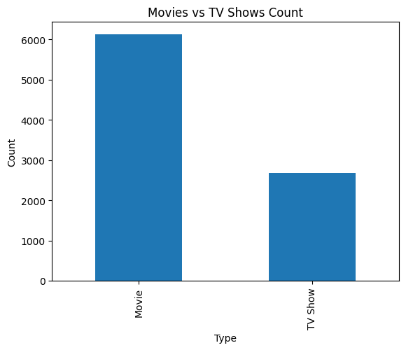
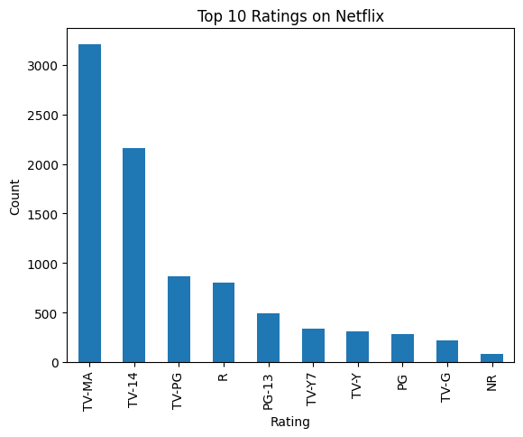
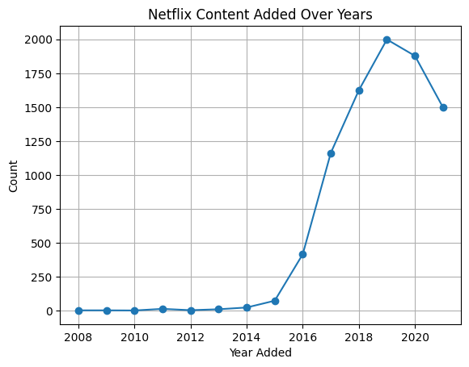
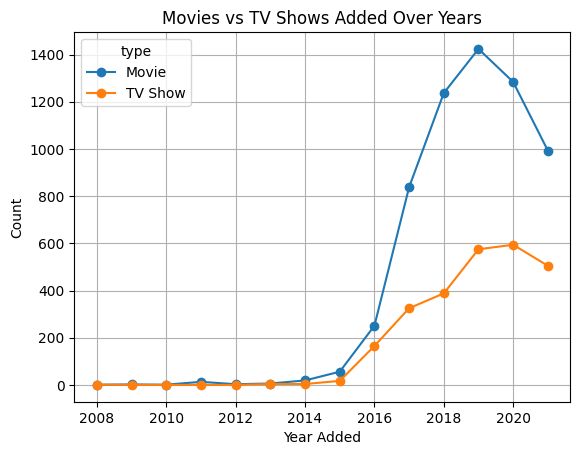
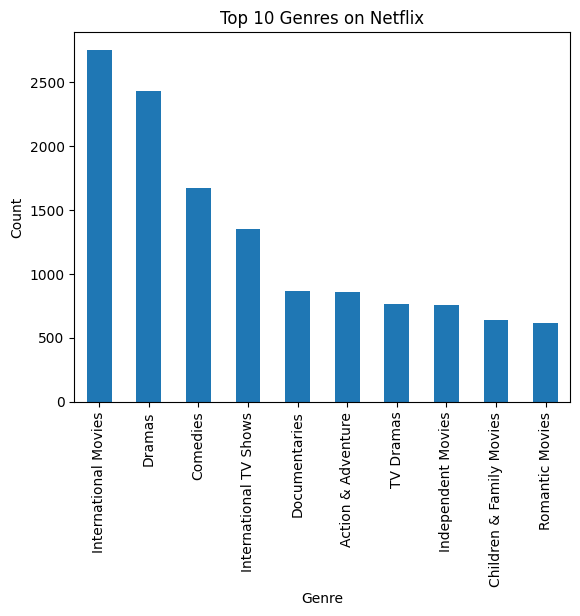
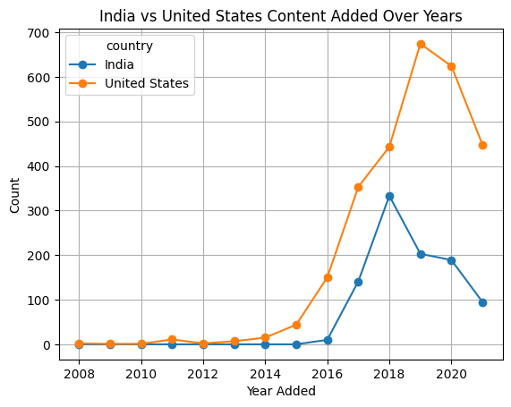

# 🎬 Netflix Data Analytics Project (Python)

This project analyzes Netflix Movies & TV Shows dataset using **Python, Pandas, NumPy, and Matplotlib**.

The goal of this project is to explore Netflix content trends and visualize insights in an easy way.

---

## 📌 Project Features
✅ Data Cleaning (Missing values handling)  
✅ Date Conversion & Feature Engineering  
✅ Exploratory Data Analysis (EDA)  
✅ Visualizations using Matplotlib  
✅ Insights based on content type, country, ratings, and trends  

---

## 📂 Dataset
- `netflix_titles.csv` (Original Dataset)
- `netflix_cleaned.csv` (Cleaned Dataset)

---

## 🛠 Tools & Libraries Used
- Python 3
- Pandas
- NumPy
- Matplotlib

---

## 📊 Visualizations & Results

### 1️⃣ Movies vs TV Shows Count

### 2️⃣ Top 10 Countries Producing Netflix Content

### 3️⃣ Top 10 Ratings on Netflix

### 4️⃣ Netflix Content Added Over Years

### 5️⃣ Movies vs TV Shows Added Over Years

### 6️⃣ Top 10 Genres on Netflix

### 7️⃣ India vs USA Content Trend Over Years

---

## 📌 Key Insights
- Netflix has more **Movies** compared to TV Shows.
- The **United States** contributes the highest content.
- Content addition increased rapidly after 2016.
- India is growing fast in Netflix content over the years.

---

## 📁 Project Files
- `notebooks/netflix_analysis.ipynb` → Full analysis notebook  
- `netflix_titles.csv` → Raw dataset  
- `netflix_cleaned.csv` → Cleaned dataset  
- `screenshots/` → Graph images  

---

## 👨‍💻 Author
**Akhilesh**  
Data Analytics Student  

---
⭐ If you like this project, give it a star on GitHub!
